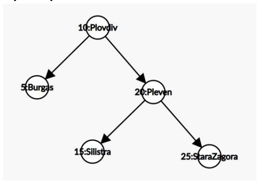

# FAQ

# Задача 1
## Kth Smallest Element in a BST

По даден корен на двоично наредено дърво и цяло число k, върнете k-тият най-малък елемент (броим от 1) от всички върхове на дървото.

**Example 1:**


```
Input: root = [3,1,4,null,2], k = 1
Output: 1
```
**Example 2:**


```
Input: root = [5,3,6,2,4,null,null,1], k = 3
Output: 3
 ```

**Constraints:**

- The number of nodes in the tree is n.
- 1 <= k <= n <= 104
- 0 <= Node.val <= 104

# Клас BST
### За следващите задачи се иска да се създаде клас BST, който ще представлява двоично наредено дърво
Нашето дърво ще пази двойки ключ-стойност. Нека ключ и стойност бъдат генерични параметри. Наредбата ще бъде по ключове. При търсене търсим по ключ и намираме стойност.    
1. Създайте контруктор, който приема като аргумент сортиран масив от двойки ключ-стойност.
2. Метод prittyPrint(), който извежда дървото на екрана по подходящ начин.
3. Метод contains(T key), който проверява дали ключ key се съдържа в дървото.   
4. Метод height(), който намира височината на дървото.
5. Mетод get(T key), който по даден ключ връща стойносттна, която му отговаря
6. Метод put(T key, V value), поставя наредената двойка key-value в дървото на подходящото място.
7. Метод delete(T key), трие двойката ключ-стойност от дървото.
8. Метод serialize(std::ostream& out) за сериализация на дървото по следният начин (Scheme format):
- Празното дърво се представя като “()”
- Нека е дадено дървото t с корен x:y, ляво поддърво tL и дясно поддърво tR. Ако sL е
представянето в “Scheme format” на tL, a sR – на tR, то низът “(x:y sL sR)” е
представянето на дървото t, където “x”, “sL” и “sR” са съответните низове.
Пример: 



се представя като

(10:Plovdiv (20:Pleven (25:StaraZagora () ()) (15:Silistra () ())) (5:Burgas () ()))

9. Предикат isBST() за проверка. 
